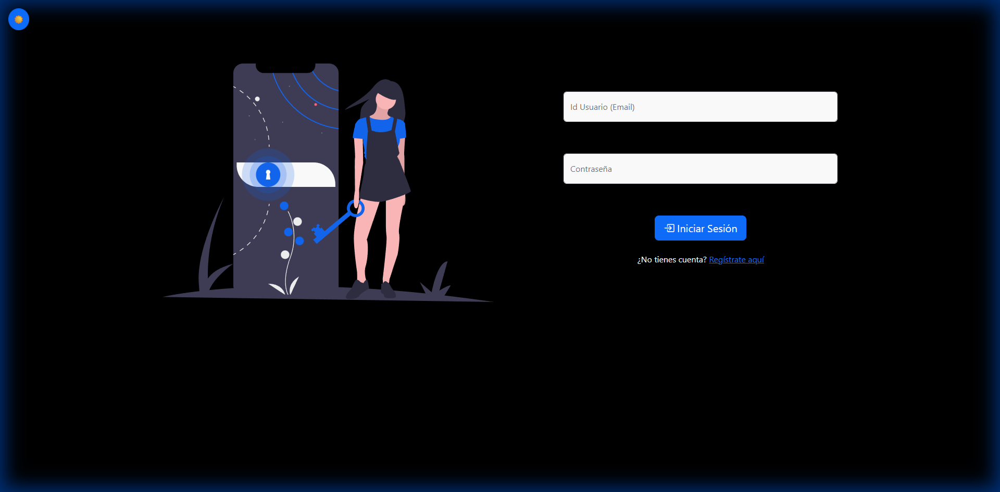
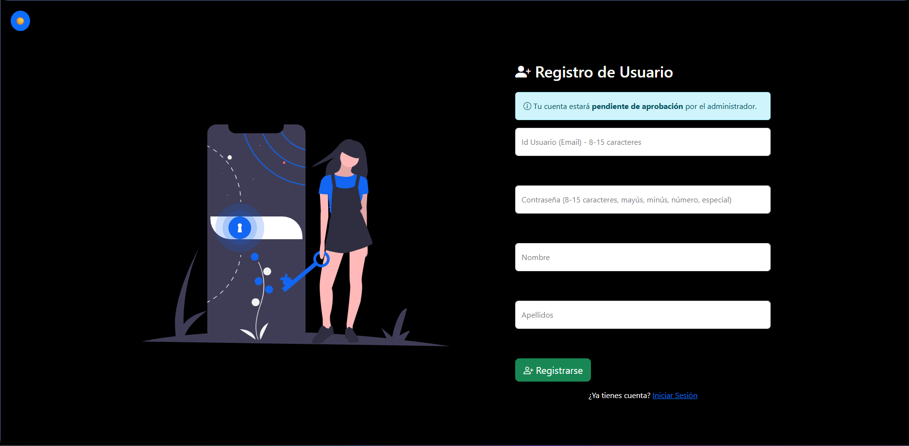
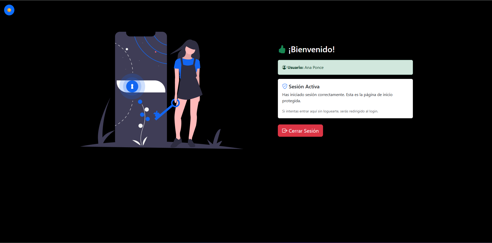
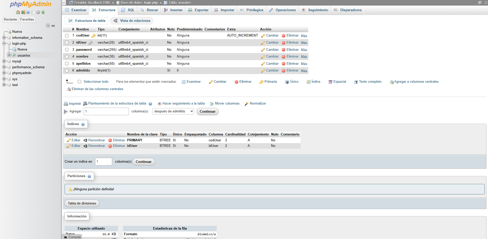
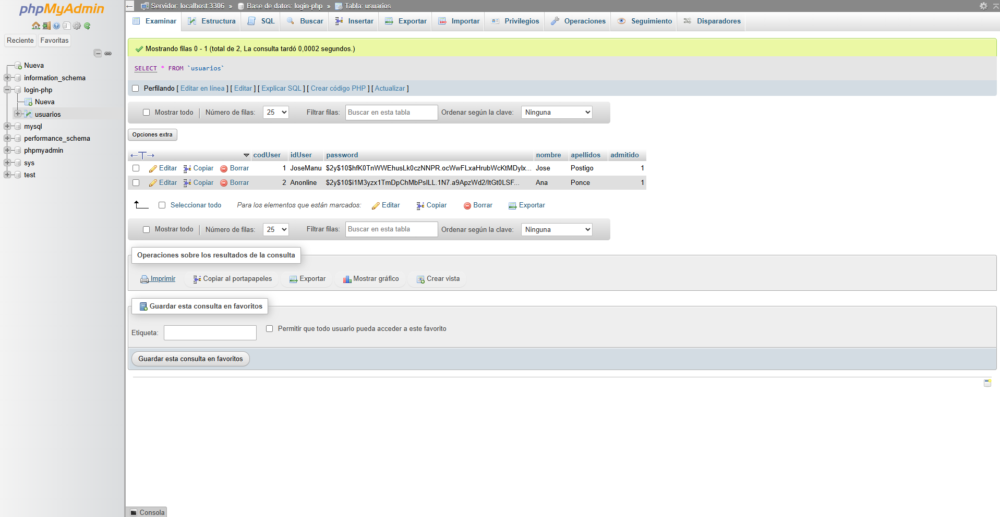

# Login MVC Seguro - PHP + MariaDB

Sistema de autenticación seguro implementado con el patrón **Modelo-Vista-Controlador (MVC)** en PHP, siguiendo las mejores prácticas de seguridad web.

## Descripción

Esta aplicación implementa un sistema de login/registro completo con múltiples capas de seguridad, diseñado como ejercicio práctico para aprender seguridad en aplicaciones web PHP-MySQL.

---

## Capturas de Pantalla

### Página de Login


### Página de Registro


### Dashboard (después de iniciar sesión)


### Estructura de la Base de Datos (phpMyAdmin)


### Usuarios en la Base de Datos



---

## Arquitectura MVC

El patrón **Modelo-Vista-Controlador (MVC)** es un patrón de diseño que separa la aplicación en tres componentes principales:

- **Modelo (Model):** Gestiona los datos y la lógica de negocio. Se comunica con la base de datos.
- **Vista (View):** Se encarga de la presentación. Muestra los datos al usuario mediante HTML/CSS.
- **Controlador (Controller):** Actúa como intermediario. Recibe las peticiones del usuario, las procesa y decide qué vista mostrar.

Esta separación facilita el mantenimiento, las pruebas y la escalabilidad del código.

El proyecto sigue el patrón **Modelo-Vista-Controlador** para separar responsabilidades:

```
Login-MVC/
├── index.php                      # Front Controller (punto de entrada)
│
├── Config/                        # Configuración
│   ├── Database.php               # Conexión a la base de datos (PDO)
│   ├── SessionConfig.php          # Configuración de sesiones seguras
│   └── SecurityHelper.php         # Funciones de seguridad
│
├── Controllers/                   # Controladores
│   └── AuthController.php         # Controlador de autenticación
│
├── Models/                        # Modelos
│   └── User.php                   # Modelo de usuarios
│
├── Views/                         # Vistas
│   ├── login.php                  # Formulario de login
│   ├── registro.php               # Formulario de registro
│   ├── dashboard.php              # Página de bienvenida
│   ├── css/
│   │   └── estilos.css            # Estilos personalizados
│   ├── js/
│   │   └── validarDatos.js        # Validación JavaScript
│   └── img/
│       └── login.svg              # Imagen decorativa
│
├── database/                      # Base de datos
│   └── login-php.sql              # Script SQL para crear la BD
│
├── img/                           # Capturas para README
│   ├── login_page.png
│   ├── registro_page.png
│   ├── phpmyadmin_structure.png
│   └── phpmyadmin_users.png
│
└── README.md                      # Este archivo
```

### Flujo de la Aplicación

```
┌─────────────────┐
│   index.php     │  ← Controlador Frontal (punto de entrada)
│ (enrutamiento)  │
└────────┬────────┘
         │
         ▼
┌─────────────────┐
│ SessionConfig   │  ← Configura sesión segura (cookies, tokens)
│ SecurityHelper  │  ← Funciones de seguridad (sanitización, CSRF)
└────────┬────────┘
         │
         ▼
┌─────────────────┐                          ┌─────────────────┐
│ AuthController  │  ← Lógica de aplicación   │   User.php      │  ← Acceso a datos
│  (Controlador)  │    (procesa peticiones)  │   (Modelo)      │    (consultas BD)
│                 │────────────────────────▶ │                 │
└────────┬────────┘                          └────────┬────────┘
         │                                            │
         ▼                                            ▼
┌─────────────────┐                          ┌─────────────────┐
│    Vistas       │  ← Interfaz de usuario   │   Base Datos    │  ← Almacenamiento
│ login/registro/ │    (HTML/CSS/JS)         │   (MariaDB)     │    (persistencia)
│   dashboard     │                          └─────────────────┘
└─────────────────┘
```

---

## Características de Seguridad Implementadas

### 1. Validación JavaScript (Frontend)

La validación en el lado del cliente permite dar feedback inmediato al usuario antes de enviar el formulario. Verificamos que el idUsuario y la contraseña cumplan con los requisitos de longitud y caracteres permitidos. Esta validación mejora la experiencia de usuario pero NUNCA debe ser la única validación, ya que puede ser deshabilitada.

**Archivo:** `Views/js/validarDatos.js`

> <sub>javascript</sub>

```javascript
// Requisitos de contraseña:
// - Longitud: 8-15 caracteres
// - Al menos una mayúscula
// - Al menos una minúscula
// - Al menos un número
// - Al menos un carácter especial: !@#$%^&*_+-[]{}:,.?
// - NO contener: ' " \ / < > = ( )

if (password.length < 8 || password.length > 15 || /['\"'\"\\\/\<\>=()]/.test(password)) {
    valido = false;
}
```

**Caracteres especiales PERMITIDOS:** `!@#$%^&*_+-[]{}:,.?`

**Caracteres PROHIBIDOS:** `' " \ / < > = ( )`

---

### 2. Sanitización PHP (Backend)

La sanitización en el servidor es obligatoria para prevenir ataques XSS (Cross-Site Scripting) e inyección de código. Limpiamos todos los datos de entrada antes de usarlos, eliminando espacios, barras invertidas y convirtiendo caracteres especiales a entidades HTML.

**Archivo:** `Config/SecurityHelper.php`

> <sub>php</sub>

```php
public static function sanitizeInput($data)
{
    $data = trim($data);           // Eliminar espacios
    $data = stripslashes($data);   // Eliminar barras invertidas
    $data = htmlspecialchars($data, ENT_QUOTES, 'UTF-8');  // Prevenir XSS
    return $data;
}
```

---

### 3. Cookies de Sesión Seguras

Configuramos las cookies de sesión con parámetros de seguridad para prevenir ataques. `httponly` evita que JavaScript acceda a la cookie (previene robo por XSS), y `samesite=Strict` evita que la cookie se envíe en peticiones desde otros sitios (previene CSRF).

**Archivo:** `Config/SessionConfig.php`

> <sub>php</sub>

```php
session_set_cookie_params([
    'lifetime' => 3600,          // 1 hora de vida
    'path' => '/',               // Disponible en todo el dominio
    'httponly' => true,          // NO accesible vía JavaScript (previene XSS)
    'samesite' => 'Strict',      // Previene ataques CSRF
    // 'secure' => true,         // Solo HTTPS (descomentar en producción)
]);
```

| **Parámetro** | **Valor** |          **Protección**          |
| :-----------: | :-------: | :------------------------------: |
|  `httponly`   |  `true`   | Previene robo de cookies por XSS |
|  `samesite`   | `Strict`  |      Previene ataques CSRF       |
|   `secure`    |  `true`   |     Solo HTTPS (producción)      |

---

### 4. Token CSRF

El token CSRF (Cross-Site Request Forgery) protege contra ataques donde un sitio malicioso intenta enviar formularios en nombre del usuario. Generamos un token aleatorio único por sesión, lo incluimos en cada formulario como campo oculto, y verificamos que coincida antes de procesar cualquier operación.

**Generación** (`Config/SessionConfig.php`):

> <sub>php</sub>

```php
if (empty($_SESSION['csrf_token'])) {
    $csrf_token = bin2hex(openssl_random_pseudo_bytes(64));
    $_SESSION['csrf_token'] = $csrf_token;
}
```

**En el formulario** (`Views/login.php`):

> <sub>html</sub>

```html
<input type="hidden" name="csrf_token" 
       value="<?php echo htmlspecialchars($_SESSION['csrf_token']); ?>">
```

**Validación** (`Config/SecurityHelper.php`):

> <sub>php</sub>

```php
public static function validateCSRFToken()
{
    if (!isset($_POST['csrf_token']) || !isset($_SESSION['csrf_token'])) {
        return false;
    }
    return hash_equals($_SESSION['csrf_token'], $_POST['csrf_token']);
}
```

---

### 5. Límite de Sesión (2 horas)

Establecemos un tiempo máximo absoluto de sesión de 2 horas. Aunque el usuario esté activo, la sesión expirará automáticamente después de este tiempo, obligándole a volver a autenticarse. Esto limita el tiempo de exposición en caso de robo de sesión.

**Archivo:** `Config/SessionConfig.php`

> <sub>php</sub>

```php
$session_max_lifetime = 7200;  // 2 horas = 7200 segundos

if (!isset($_SESSION['session_created'])) {
    $_SESSION['session_created'] = time();
}

if (time() - $_SESSION['session_created'] >= $session_max_lifetime) {
    session_unset();
    session_destroy();
    header("Location: index.php?action=login&expired=1");
    exit();
}
```

---

### 6. Regeneración de ID de Sesión (cada 20 minutos)

Regeneramos el ID de sesión periódicamente para prevenir ataques de fijación de sesión (session fixation). Un atacante que obtenga el ID de sesión solo tendrá una ventana de 20 minutos para usarlo antes de que cambie.

**Archivo:** `Config/SessionConfig.php`

> <sub>php</sub>

```php
$regenerate_interval = 1200;  // 20 minutos

if (!isset($_SESSION['last_regeneration'])) {
    $_SESSION['last_regeneration'] = time();
}

if (time() - $_SESSION['last_regeneration'] >= $regenerate_interval) {
    session_regenerate_id(true);  // Regenera y elimina sesión antigua
    $_SESSION['last_regeneration'] = time();
}
```

---

### 7. Control de Intentos de Login (máximo 5) - OPCIONAL

Implementamos un límite de intentos de login fallidos para prevenir ataques de fuerza bruta. Después de 5 intentos fallidos, el usuario queda bloqueado durante 15 minutos. Esta funcionalidad es opcional según el enunciado.

**Archivo:** `Config/SecurityHelper.php`

> <sub>php</sub>

```php
const MAX_LOGIN_ATTEMPTS = 5;
const LOCKOUT_TIME = 900;  // 15 minutos

public static function checkLoginAttempts()
{
    if ($_SESSION['login_attempts'] >= self::MAX_LOGIN_ATTEMPTS) {
        $time_passed = time() - $_SESSION['first_attempt_time'];
        if ($time_passed < self::LOCKOUT_TIME) {
            $remaining = ceil((self::LOCKOUT_TIME - $time_passed) / 60);
            return [
                'blocked' => true,
                'message' => "Demasiados intentos. Espera {$remaining} minutos."
            ];
        }
    }
    return ['blocked' => false];
}
```

---

### 8. Almacenamiento Seguro de Contraseñas

Las contraseñas NUNCA se almacenan en texto plano. Usamos `password_hash()` con el algoritmo bcrypt que genera un hash único incluyendo un salt aleatorio. Para verificar, usamos `password_verify()` que compara de forma segura sin exponer el hash.

**Archivo:** `Controllers/AuthController.php`

> <sub>php</sub>

```php
// En el registro, hasheamos la contraseña
$passwordHash = password_hash($password, PASSWORD_DEFAULT);
```

**Archivo:** `Models/User.php`

> <sub>php</sub>

```php
// En el login, verificamos con password_verify()
if (password_verify($password, $row['password'])) {
    return $row;  // Login exitoso
}
```

---

### 9. Consultas SQL Preparadas (PDO)

Usamos PDO (PHP Data Objects) con consultas preparadas para prevenir ataques de inyección SQL. Los datos del usuario nunca se concatenan directamente en la consulta; se pasan como parámetros que PDO escapa automáticamente.

**Archivo:** `Models/User.php`

> <sub>php</sub>

```php
// SEGURO: Consulta preparada con placeholder
$query = "SELECT * FROM usuarios WHERE idUser = ? LIMIT 1";
$stmt = $this->PDO->prepare($query);
$stmt->bindParam(1, $idUser);
$stmt->execute();
```

---

### 10. Logout Seguro

El cierre de sesión debe ser completo: no basta con destruir la sesión, también debemos eliminar la cookie del navegador estableciendo una fecha de expiración en el pasado. Esto evita que un atacante pueda reutilizar una cookie de sesión capturada.

**Archivo:** `Controllers/AuthController.php`

> <sub>php</sub>

```php
public function logout()
{
    session_unset();      // 1. Limpiar variables
    session_destroy();    // 2. Destruir sesión
    
    // 3. Eliminar cookie
    if (ini_get("session.use_cookies")) {
        $params = session_get_cookie_params();
        setcookie(
            session_name(),
            '',
            time() - 42000,  // Expiración en el pasado
            $params["path"],
            $params["domain"],
            $params["secure"],
            $params["httponly"]
        );
    }
    
    header('Location: index.php?action=login');
}
```

---

### 11. Campo 'admitido' para Aprobación de Admin - OPCIONAL

Esta funcionalidad opcional (Puntos 9 y 10 del ejercicio anterior) permite que los usuarios se registren pero no puedan acceder hasta que un administrador los apruebe. Los nuevos usuarios se crean con `admitido=0` y solo pueden hacer login cuando un admin cambia el valor a `1`.

**Tabla SQL:**

> <sub>sql</sub>

```sql
ALTER TABLE usuarios ADD COLUMN admitido TINYINT(1) DEFAULT 0;
```

**Verificación en login** (`Controllers/AuthController.php`):

> <sub>php</sub>

```php
if (isset($user['admitido']) && $user['admitido'] != 1) {
    $_SESSION['error'] = "Tu cuenta está pendiente de aprobación.";
    exit();
}
```

| **Estado** | **admitido** | **¿Puede hacer login?** |
| :--------: | :----------: | :---------------------: |
|   Nuevo    |      0       |           No            |
|  Aprobado  |      1       |           Sí            |

---

## Base de Datos

La base de datos utiliza una única tabla `usuarios` que almacena toda la información necesaria para la autenticación. El archivo SQL exportado se encuentra en `database/login-php.sql`.

### Estructura de la Tabla `usuarios`

| Campo       | Tipo                 | Descripción                                        |
| ----------- | -------------------- | -------------------------------------------------- |
| `codUser`   | INT AUTO_INCREMENT   | Clave primaria, identificador único interno        |
| `idUser`    | VARCHAR(50) UNIQUE   | Identificador del usuario (email), debe ser único  |
| `password`  | VARCHAR(255)         | Contraseña hasheada con bcrypt (NUNCA texto plano) |
| `nombre`    | VARCHAR(100)         | Nombre del usuario                                 |
| `apellidos` | VARCHAR(100)         | Apellidos del usuario                              |
| `admitido`  | TINYINT(1) DEFAULT 0 | 0 = pendiente de aprobación, 1 = aprobado          |

> <sub>sql</sub>

```sql
CREATE TABLE usuarios (
    codUser INT AUTO_INCREMENT PRIMARY KEY,
    idUser VARCHAR(50) NOT NULL UNIQUE,
    password VARCHAR(255) NOT NULL,
    nombre VARCHAR(100),
    apellidos VARCHAR(100),
    admitido TINYINT(1) DEFAULT 0
);
```

### Usuario de Prueba

> <sub>sql</sub>

```sql
-- Primero, genera el hash de la contraseña en PHP:
-- echo password_hash('Test123!', PASSWORD_DEFAULT);

INSERT INTO usuarios (idUser, password, nombre, apellidos, admitido) 
VALUES ('test@test.com', '$2y$10$...hash...', 'Usuario', 'Prueba', 1);
```

---

## Instalación

1. **Clonar el repositorio:**

   > <sub>bash</sub>

   ```bash
   git clone https://github.com/jpossua/Login-MVC.git
   ```

2. **Copiar a la carpeta del servidor web:**

   > <sub>bash</sub>

   ```bash
   # Laragon
   C:/laragon/www/
   
   # XAMPP
   C:/xampp/htdocs/
   ```

3. **Importar la base de datos:**
   
   - **Usando phpMyAdmin:**
     - Abrir phpMyAdmin (http://localhost/phpmyadmin)
     - Crear una nueva base de datos llamada `login-php`
     - Ir a la pestaña "Importar"
     - Seleccionar el archivo `database/login-php.sql`
     - Clic en "Continuar"

4. **Configurar la conexión** en `Config/Database.php`:

   > <sub>php</sub>

   ```php
   private $host = 'localhost';
   private $db_name = 'login-php';
   private $username = 'LoginPhp';
   private $password = '95f90HZJy3sb';
   ```

5. **Acceder a la aplicación:**
   ```
   http://localhost/Login-MVC/
   ```

---

## Tecnologías Utilizadas

| **Tecnología**  | **Versión** |        **Uso**        |
| :-------------: | :---------: | :-------------------: |
|       PHP       |     8.x     |        Backend        |
|     MariaDB     |    11.x     |     Base de datos     |
|   phpMyAdmin    |    5.2.3    | Administración de BD  |
|       PDO       |      -      | Conexión segura a BD  |
|      HTML       |      5      | Estructura de páginas |
|       CSS       |      3      |        Estilos        |
|    Bootstrap    |    5.3.8    |     Framework CSS     |
| Bootstrap Icons |   1.13.1    |        Iconos         |
|  Font Awesome   |    6.0.0    |  Iconos adicionales   |
|   JavaScript    |    ES6+     |  Validación frontend  |

---

## Referencias

**Documentación del ejercicio:**
- [LOGIN CON PHP + MARIADB - Patrón MVC](https://charmed-group-fc8.notion.site/LOGIN-CON-PHP-MARIADB-2b960ff317c980ed822dc0ad370f173d)

**Documentación técnica:**
- [PHP Manual - Password Hashing](https://www.php.net/manual/es/function.password-hash.php)
- [PHP Manual - Sessions](https://www.php.net/manual/es/book.session.php)
- [OWASP - Session Management](https://owasp.org/www-project-web-security-testing-guide/)
- [PDO Prepared Statements](https://www.php.net/manual/es/pdo.prepared-statements.php)

---

<!--## Autor

**Estudiante de DAW - IES Playamar**

Ejercicio práctico de seguridad PHP-MySQL siguiendo el patrón MVC.

--- -->

<!--## Licencia

Este proyecto es de uso educativo.-->
